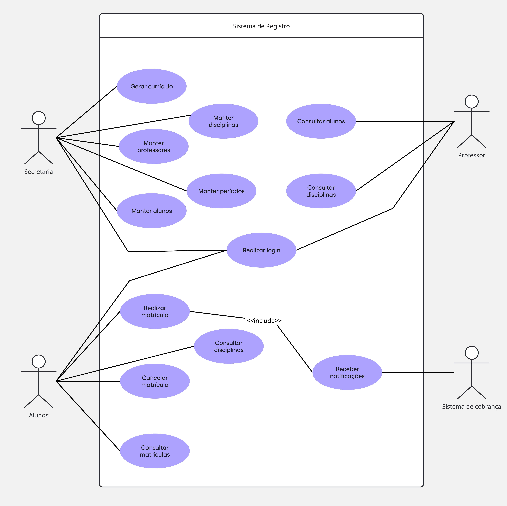

# Diagrama de caso de uso

# Histórias de Usuário

## Aluno

### HU01 — Realizar login

**Como** aluno, **quero** realizar login no sistema utilizando minha senha, **para** acessar as funcionalidades de matrícula.

### HU02 — Consultar disciplinas

**Como** aluno, **quero** consultar as disciplinas disponíveis para o próximo semestre, **para** escolher quais disciplinas desejo cursar.

### HU03 — Realizar matrícula

**Como** aluno, **quero** realizar minha matrícula nas disciplinas disponíveis, **para** cursá-las no próximo semestre.

**Critérios de aceitação:**
- O aluno deve estar autenticado.
- O aluno pode selecionar até 4 disciplinas como primeira opção.
- O aluno pode selecionar até 2 disciplinas como alternativas.
- A disciplina não pode possuir mais de 60 alunos matriculados.
- A matrícula deve ocorrer dentro do período definido pela secretaria.
- Após a matrícula, o sistema deve notificar o sistema de cobranças.

### HU04 — Cancelar matrícula

**Como** aluno, **quero** cancelar uma matrícula realizada anteriormente, **para** alterar minha escolha de disciplinas durante o período de matrícula.

**Critérios de aceitação:**
- O aluno deve estar autenticado.
- O cancelamento deve ocorrer durante o período de matrículas.
- A matrícula cancelada não deve mais ser considerada na quantidade de alunos inscritos.

### HU05 — Consultar minhas matrículas

**Como** aluno, **quero** consultar as disciplinas nas quais estou matriculado, **para** acompanhar minha matrícula no semestre.

---

## Professor

### HU06 — Consultar alunos matriculados

**Como** professor, **quero** consultar os alunos matriculados em cada disciplina que leciono, **para** saber quais alunos participarão das minhas aulas.

---

## Secretaria

### HU07 — Gerenciar alunos

**Como** funcionário da secretaria, **quero** cadastrar e manter os dados dos alunos, **para** manter o sistema atualizado.

### HU08 — Gerenciar professores

**Como** funcionário da secretaria, **quero** cadastrar e manter os dados dos professores, **para** manter as informações dos docentes atualizadas.

### HU09 — Gerenciar disciplinas

**Como** funcionário da secretaria, **quero** cadastrar e manter as informações das disciplinas, **para** disponibilizá-las no sistema de matrículas.

### HU10 — Gerar currículo do semestre

**Como** funcionário da secretaria, **quero** gerar o currículo de cada semestre, **para** definir as disciplinas que serão oferecidas aos alunos.

### HU11 — Gerenciar período de matrículas

**Como** funcionário da secretaria, **quero** definir o período em que as matrículas estarão abertas, **para** controlar quando os alunos podem realizar ou cancelar suas matrículas.

### HU12 — Encerrar disciplinas com poucas inscrições

**Como** funcionário da secretaria, **quero** que as disciplinas com menos de 3 alunos sejam canceladas ao final do período de matrículas, **para** evitar a realização de disciplinas com baixa demanda.

---

## Sistema de Cobranças

### HU13 — Receber informações de matrícula

**Como** sistema de cobranças, **quero** receber uma notificação quando um aluno realizar sua matrícula, **para** poder realizar a cobrança correspondente às disciplinas daquele semestre.