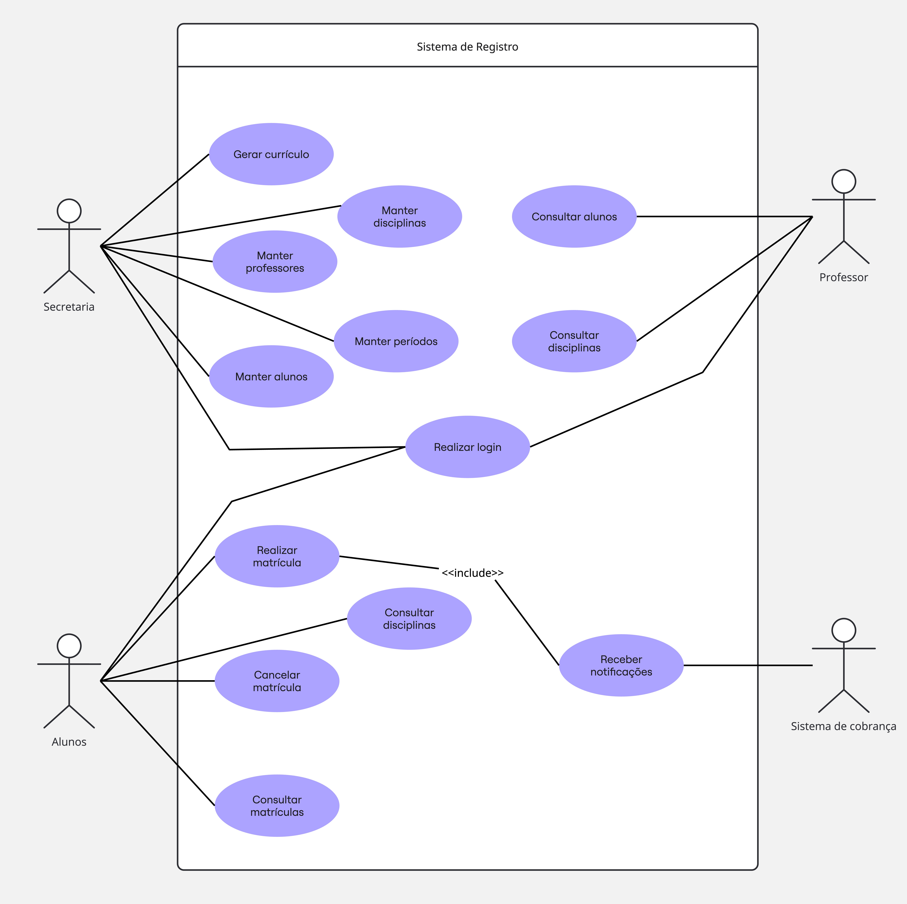
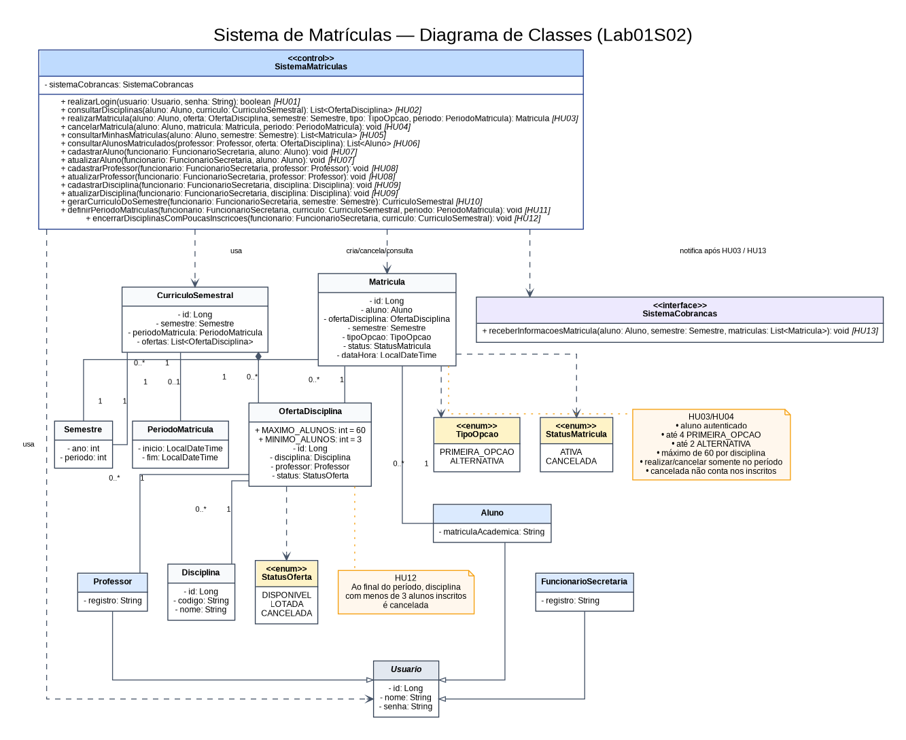

# Integrantes
- Arthur Chaves Viana Leão
- Gabriel Felipe de Sousa
- Zaine Mendes Torres

# Diagrama de caso de uso



# Histórias de Usuário

## Aluno

### HU01 — Realizar login

**Como** aluno, **quero** realizar login no sistema utilizando minha senha, **para** acessar as funcionalidades de matrícula.

### HU02 — Consultar disciplinas

**Como** aluno, **quero** consultar as disciplinas disponíveis para o próximo semestre, **para** escolher quais disciplinas desejo cursar.

### HU03 — Realizar matrícula

**Como** aluno, **quero** realizar minha matrícula nas disciplinas disponíveis, **para** cursá-las no próximo semestre.

**Critérios de aceitação:**
- O aluno deve estar autenticado.
- O aluno pode selecionar até 4 disciplinas como primeira opção.
- O aluno pode selecionar até 2 disciplinas como alternativas.
- A disciplina não pode possuir mais de 60 alunos matriculados.
- A matrícula deve ocorrer dentro do período definido pela secretaria.
- Após a matrícula, o sistema deve notificar o sistema de cobranças.

### HU04 — Cancelar matrícula

**Como** aluno, **quero** cancelar uma matrícula realizada anteriormente, **para** alterar minha escolha de disciplinas durante o período de matrícula.

**Critérios de aceitação:**
- O aluno deve estar autenticado.
- O cancelamento deve ocorrer durante o período de matrículas.
- A matrícula cancelada não deve mais ser considerada na quantidade de alunos inscritos.

### HU05 — Consultar minhas matrículas

**Como** aluno, **quero** consultar as disciplinas nas quais estou matriculado, **para** acompanhar minha matrícula no semestre.

---

## Professor

### HU06 — Consultar alunos matriculados

**Como** professor, **quero** consultar os alunos matriculados em cada disciplina que leciono, **para** saber quais alunos participarão das minhas aulas.

---

## Secretaria

### HU07 — Gerenciar alunos

**Como** funcionário da secretaria, **quero** cadastrar e manter os dados dos alunos, **para** manter o sistema atualizado.

### HU08 — Gerenciar professores

**Como** funcionário da secretaria, **quero** cadastrar e manter os dados dos professores, **para** manter as informações dos docentes atualizadas.

### HU09 — Gerenciar disciplinas

**Como** funcionário da secretaria, **quero** cadastrar e manter as informações das disciplinas, **para** disponibilizá-las no sistema de matrículas.

### HU10 — Gerar currículo do semestre

**Como** funcionário da secretaria, **quero** gerar o currículo de cada semestre, **para** definir as disciplinas que serão oferecidas aos alunos.

### HU11 — Gerenciar período de matrículas

**Como** funcionário da secretaria, **quero** definir o período em que as matrículas estarão abertas, **para** controlar quando os alunos podem realizar ou cancelar suas matrículas.

### HU12 — Encerrar disciplinas com poucas inscrições

**Como** funcionário da secretaria, **quero** que as disciplinas com menos de 3 alunos sejam canceladas ao final do período de matrículas, **para** evitar a realização de disciplinas com baixa demanda.

---

## Sistema de Cobranças

### HU13 — Receber informações de matrícula

**Como** sistema de cobranças, **quero** receber uma notificação quando um aluno realizar sua matrícula, **para** poder realizar a cobrança correspondente às disciplinas daquele semestre.
---

# Diagrama de Classes — Lab01S02



> O diagrama de classes e o projeto Java da Lab01S02 foram modelados a partir do diagrama de caso de uso e das histórias HU01–HU13 acima. O diagrama de caso de uso original deve permanecer em `./assets/diagrama-caso-de-uso.jpg`.

## Execução do protótipo (Lab01S03)

O sistema está implementado em Java com interface de console e persistência local em arquivo. Na raiz do repositório, compile e execute com:

```sh
mkdir -p sistema-matriculas/bin
javac -d sistema-matriculas/bin $(find sistema-matriculas/src -name '*.java')
java -cp sistema-matriculas/bin br.edu.pucminas.matriculas.App
```

No primeiro uso, são criados cadastros de demonstração:

| Perfil | ID | Senha |
| --- | ---: | --- |
| Secretaria | 1 | `secretaria` |
| Professor | 2 | `professor` |
| Aluno | 3 | `aluno` |

Os dados são gravados em `sistema-matriculas/dados/sistema.dat`. O caminho pode ser alterado pela propriedade Java `-Dmatriculas.arquivo=/caminho/arquivo.dat`. A secretaria pode cadastrar e atualizar usuários, cursos e disciplinas; gerar currículos, incluir ofertas, configurar o período de matrícula e encerrar ofertas com menos de três inscrições. Ao fim do período, o sistema encerra automaticamente as ofertas com menos de três inscritos. Alunos podem selecionar até quatro primeiras opções e duas alternativas, respeitados período e limite de 60 vagas. Professores consultam os alunos de suas ofertas. A integração de cobrança é representada por um adaptador de console.
